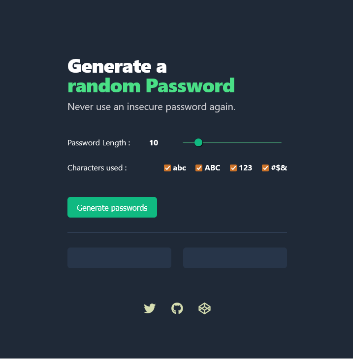

# Random Password Generator

A web app generates two random password inside the browser.

The length and characters of the password is based on the users' preference.

This project is a part of [Scrimba](https://scrimba.com/learn/learnjavascript) solo JavaScript challenge

## 🛠 Skills
Javascript, HTML, CSS...

## Screenshots

## Demo

Demo Link: [Password Generator](https://thepran.github.io/password-generator/)

## Feedback

If you have any feedback, please reach out to us at negipranaysingh@gmail.com

